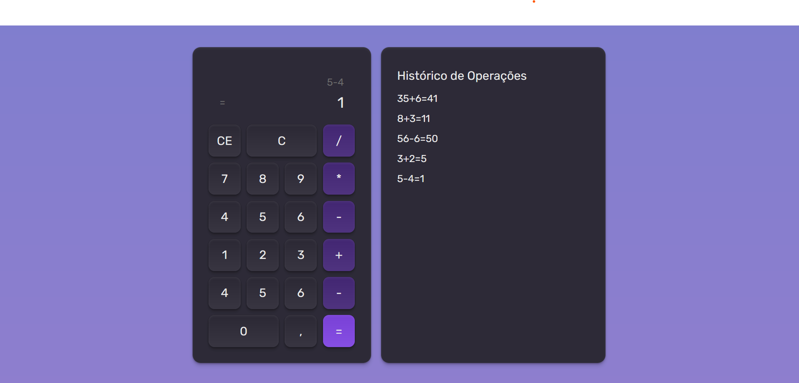

# 🧮 Calculadora com React.js

Este projeto é uma **calculadora funcional** desenvolvida em **React.js**, com o objetivo de **praticar e consolidar os fundamentos do React**. Foi criado como parte dos estudos realizados no programa da [Rocketseat](https://www.rocketseat.com.br/), e reforça conceitos essenciais como:

- Componentização
- Estado (`useState`)
- Efeitos colaterais (`useEffect`)
- Context API
- Hook customizado
- Variantes de componentes
- Estilização com Tailwind CSS (via CDN)
- Gerenciamento de histórico com `localStorage`

---

## 📸 Demonstração

---

## 🧠 Por que esse projeto?

Decidi construir essa calculadora como um **exercício prático para fixar os principais fundamentos do React.js**. Em vez de apenas consumir conteúdo teórico, resolvi aplicar os aprendizados de forma concreta, criando um projeto com:

- Interface interativa e responsiva
- Componentes reutilizáveis
- Gerenciamento de dados globais (histórico de cálculos)
- Separação de responsabilidades e boas práticas

---

## 🧱 Estrutura do Projeto

📄 index.html # HTML base com scripts React, Tailwind e Babel via CDN

**Obs.:** Este projeto não utiliza bundlers como Webpack ou Vite. Toda a lógica React está embutida diretamente no HTML através de um `<script type="text/babel">`, ideal para prototipação rápida e aprendizado.

---

## ⚙️ Funcionalidades

- ✅ Operações básicas: soma, subtração, multiplicação e divisão
- ✅ Botões de limpar (`C`) e apagar último (`CE`)
- ✅ Histórico de operações persistente com `localStorage`
- ✅ Exibição dinâmica do resultado
- ✅ Estilização customizada com cores, sombras e gradientes
- ✅ Layout responsivo

---

## 🔍 Conceitos aplicados

- **Componentização**: criação de componentes reutilizáveis como `Text`, `Button`, `Card`, `CalculatorDisplay`.
- **Hooks nativos**: `useState`, `useEffect`, `useContext`.
- **Hook customizado**: `useCalculator()` encapsula a lógica da calculadora.
- **Context API**: `CalculatorProvider` fornece o histórico de operações a toda a aplicação.
- **Estilização com Tailwind CSS**: uso de classes utilitárias e propriedades customizadas com `@theme`.
- **Persistência local**: armazenamento do histórico no `localStorage`.
- **Acessibilidade e UX**: botões acessíveis, responsividade e layout limpo.

---

## 📦 Requisitos
Este projeto não exige instalação de dependências. Tudo é executado via CDN, incluindo:

- React (v18)
- ReactDOM
- Babel Standalone
- TailwindCSS (modo browser)
